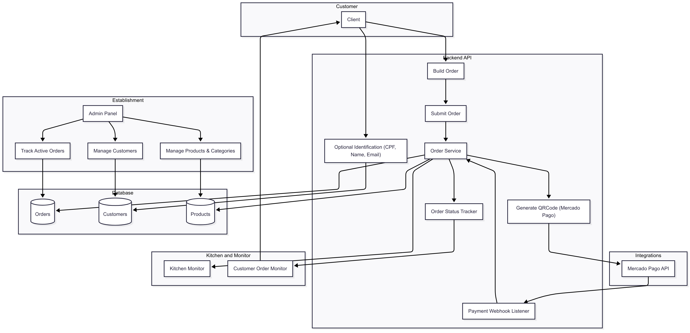
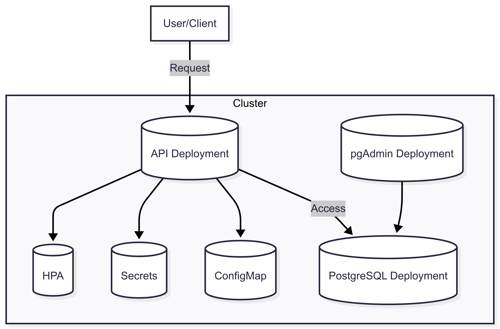

## Introduction
This project serves a as a backend for a fast food app, it was created with the intent to learn more about the hexagonal architecture and its use cases.
Project was presented by Fiap.on - Tech Challenge (Software Architecture) [2025].
This project uses the following technologies: 
* NestJS framework;
* Prisma ORM;
* Docker;

### Summary of the Flow:
* The customer optionally identifies themselves.
* They build a combo (burger, side, drink) and submit the order.
* The backend generates a payment QR code via Mercado Pago.
* Once the payment is confirmed (via webhook), the order is sent to the kitchen and shown on the customer screen.
* The admin panel allows the restaurant to manage products, customers, and live order tracking.
* All data is persisted in a PostgreSQL database.

**Diagram of the Workflow**


## Objective
This project is being created to learn more about NestJS and to complete the Tech Challenge for the college.

## Infraestructure Requirements
To orchestrate the services, Minikube was used as it provides a lightweight and efficient solution for local Kubernetes testing. This choice enables testing of scalability, resilience, and configuration of architectural components, while simulating real-world environments with support for HPA, ConfigMaps, Secrets, and data persistence.

The architecture is easily portable to managed Kubernetes services such as AKS (Azure), EKS (AWS), or GKE (Google Cloud), requiring only minimal adjustments to the manifest files.

All configuration files are located in the k8s/ directory, organized by component (api, postgres, pgadmin).

**Current infrastructure diagram:**


## Project setup (Kubernetes)
```bash
# You must have kubernetes installed

# Create a .env file and copy the content of .env.example
$ cp .env.example .env

# Up the postgres database
$ kubectl apply -f k8s/postgres/

# Run the migrations
# To run the migrations, the DATABASE_URL must point to the same port as defined in postgres service (30052)
$ npx prisma migrate dev

# Up the PgAdmin (optional)
$ kubectl apply -f k8s/pgadmin/

# Up the project
$ kubectl apply -f k8s/api/
```

## Project setup (Full-Docker)
```bash
# Install the dependencies
$ npm install

# Create a .env file and copy the content of .env.example
$ cp .env.example .env

# Up the database
$ docker-compose up -d

# Run the migrations
$ npx prisma migrate dev
```

## Project setup (Local)
```bash
# Install the dependencies
$ npm install

# Create a .env file and copy the content of .env.example
$ cp .env.example .env

# Up the database and pgadmin
$ docker-compose up -d --scale api=0

# Run the migrations
$ npx prisma migrate dev

# Run the project
$ npm run start:dev
```

## Compile and run the project
```bash
# development
$ npm run start

# watch mode
$ npm run start:dev

# production mode
$ npm run start:prod
```

## Run tests

```bash
# unit tests
$ npm run test

# test coverage
$ npm run test:cov
```

## Documentation

```bash
# Check swagger documentation
$ http://localhost:3000/api
```